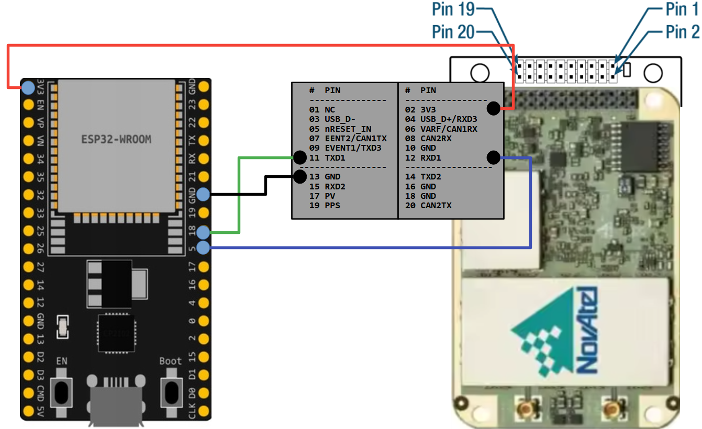

# OEM7 Heading Library for Arduino (ESP32)

Heading by the OEM7 NovAtel module

See: [OEM7 Receiver User Documentation](https://docs.novatel.com/OEM7/Content/Home.htm)

Tested on **OEM718D** connected via **UART** to **ESP WROOM-32U**

### Compute:

- UTC Time
- Best Position
- Heading information with multiple rovers

### Check:

- Receiver Status
- Antennas Status
- RTK State
- Jamming & Spoofing detection

## Pinout

| ESP32 PIN | OEM718D PIN |
| --------- | ----------- |
| 3V3       | 3V3         |
| GND       | GND         |
| 18        | 11 TXD1     |
| 5         | 12 RXD1     |



## Debug Logs

To output debug logs, declare macro DEBUGLOG in **platforio.ini** and rebuild sketch

```
[env:esp32dev]
...
build_flags = -Wall -D DEBUGLOG
...
```
